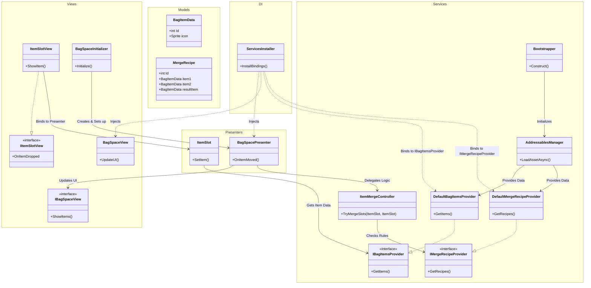

```mermaid
classDiagram
    direction TB

    %% Dependency Injection Layer
    namespace DI {
        class ServicesInstaller {
            +InstallBindings()
        }
    }

    %% Models Layer
    namespace Models {
        class BagItemData {
            +int Id
            +Sprite icon
        }
        class MergeRecipe {
            +int Id
            +BagItemData item1
            +BagItemData item2
            +BagItemData resultItem
        }
    }

    %% Views Layer
    namespace Views {
        class IBagSpaceView {
            <<interface>>
            +ShowItems()
        }
        class BagSpaceView {
            +UpdateUI()
        }
        class IItemSlotView {
            <<interface>>
            +OnItemDropped
        }
        class ItemSlotView {
            +ShowItem()
        }
        class BagSpaceInitializer {
            +Initialize()
        }
    }

    %% Presenters Layer
    namespace Presenters {
        class BagSpacePresenter {
            +OnItemMoved()
        }
        class ItemSlot {
            +SetItem()
        }
    }

    %% Services Layer
    namespace Services {
        class Bootstrapper {
            +Construct()
        }
        class AddressablesManager {
            +LoadAssetAsync()
        }
        class IBagItemsProvider {
            <<interface>>
            +GetItems()
        }
        class DefaultBagItemsProvider {
            +GetItems()
        }
        class IMergeRecipeProvider {
            <<interface>>
            +GetRecipes()
        }
        class DefaultMergeRecipeProvider {
            +GetRecipes()
        }
        class ItemMergeController {
            +TryMergeSlots(ItemSlot, ItemSlot)
        }
    }

    %% Relationships
    ServicesInstaller ..> BagSpacePresenter : Injects
    ServicesInstaller ..> BagSpaceView : Injects
    ServicesInstaller ..> DefaultBagItemsProvider : Binds to IBagItemsProvider
    ServicesInstaller ..> DefaultMergeRecipeProvider : Binds to IMergeRecipeProvider
    
    Bootstrapper --> AddressablesManager : Initializes
    AddressablesManager --> DefaultBagItemsProvider : Provides Data
    AddressablesManager --> DefaultMergeRecipeProvider : Provides Data
    
    DefaultBagItemsProvider ..|> IBagItemsProvider
    DefaultMergeRecipeProvider ..|> IMergeRecipeProvider
    
    BagSpaceInitializer --> BagSpacePresenter : Creates & Sets up
    BagSpacePresenter --> IBagSpaceView : Updates UI
    BagSpacePresenter --> ItemMergeController : Delegates Logic
    
    ItemSlotView ..|> IItemSlotView
    ItemSlotView --> ItemSlot : Binds to Presenter
    ItemSlot --> IBagItemsProvider : Gets Item Data
    
    ItemMergeController --> IMergeRecipeProvider : Checks Rules
```